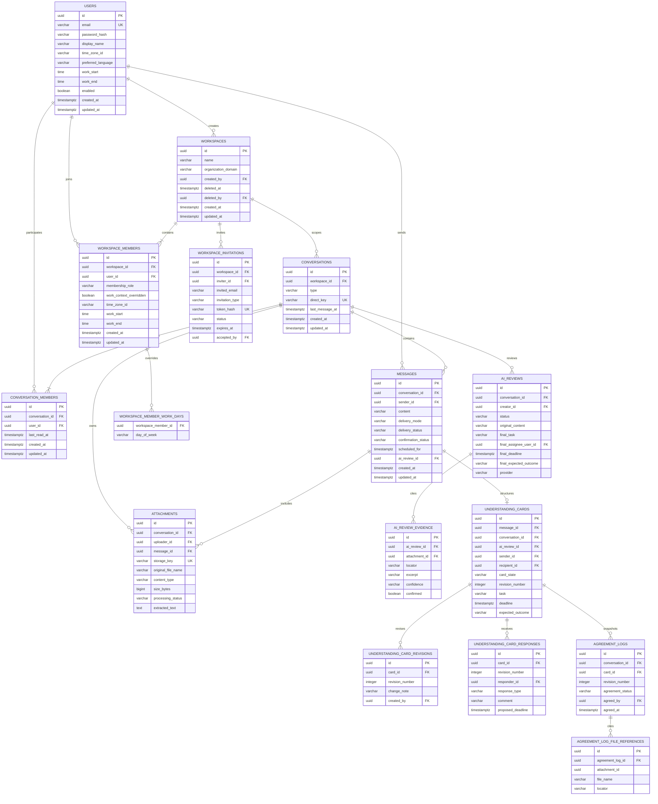

# 현재 범위 ERD

## 설계 결정

- 대화와 참여자를 분리해 추후 그룹 DM이나 채널로 확장할 수 있게 했습니다.
- 1:1 DM의 `direct_key`는 두 사용자 UUID를 정렬해 결합한 값이며 중복 DM 생성을 막습니다.
- 시간은 DB에 `timestamp with time zone`/UTC 기준으로 저장하고 응답 시 사용자의 IANA 타임존으로 표현합니다.
- `last_read_at` 이후 상대가 보낸 메시지를 계산해 읽지 않은 메시지 수를 제공합니다.
- 워크스페이스 생성자는 `OWNER` 멤버십을 가지며, 일반 멤버는 `MEMBER` 권한을 사용합니다.
- 워크스페이스 삭제는 `deleted_at`, `deleted_by`를 기록하는 소프트 삭제입니다.
- 워크스페이스 멤버의 근무 컨텍스트가 없으면 계정 기본값을 상속하고, 예외가 있으면 해당 워크스페이스에서만 우선합니다.
- AI 분석 결과는 별도 `ai_reviews` 도메인에 저장하고, 확정 전송된 메시지만 `ai_review_id`로 연결합니다.
- 공통 이해 카드는 메시지당 하나이며 수정 이력·수신자 응답·합의 로그를 분리해 상태 전이와 스냅샷을 보존합니다.
- 합의 로그의 파일 참조는 파일 이름과 위치를 복사해 두어 이후 원본 메타데이터가 바뀌어도 당시 근거를 확인할 수 있습니다.
